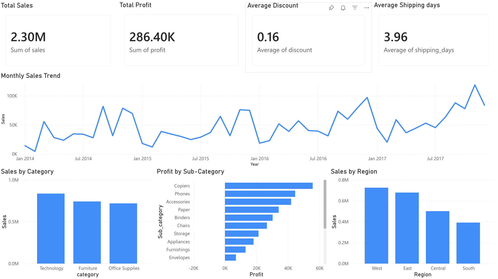
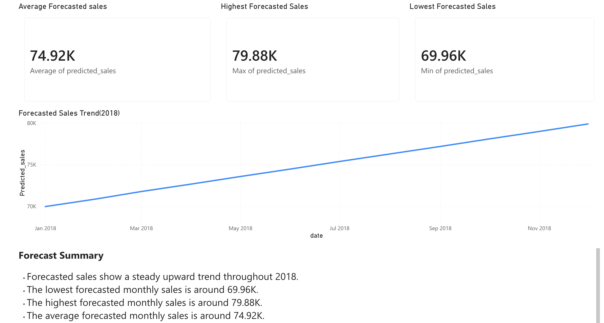

# Superstore Retail Analysis

## Project Overview
This project analyzes Superstore retail data using Power BI, SQL, and Python. The goal is to understand sales performance, profit trends, product performance, regional performance, customer segments, and sales forecasting.

## Tools Used
- Power BI
- SQL
- Python / Jupyter Notebook
- Excel / CSV
- Data Visualization
- Data Analysis

## Dashboard Preview

### Overview Dashboard

### Product Analysis

### Regional & Customer Analysis

### Sales Forecasting

## Project Files
- `dashboard/` - Power BI dashboard files and dashboard screenshots
- `data/` - Original and cleaned Superstore datasets
- `sql/` - SQL queries used for analysis
- `notebooks/` - Jupyter notebooks for data cleaning and forecasting
- `outputs/` - Forecasting output and SQL result screenshots

## Key Analysis Areas
- Sales performance
- Profit analysis
- Product category and sub-category analysis
- Regional performance
- Customer segment analysis
- Discount impact analysis
- Shipping analysis
- Sales forecasting

## Key Insights
- Sales and profit performance vary across product categories and regions.
- Some sub-categories generate weak profit performance and need further business review.
- Discount levels can affect profitability.
- Regional and customer segment analysis helps identify stronger and weaker business areas.
- Sales forecasting provides an estimated future sales trend based on historical data.

## Conclusion
This project presents a complete retail data analysis workflow using SQL, Python, and Power BI. The final dashboards summarize business performance and provide insights into sales, profit, customers, products, regions, and forecasting.
